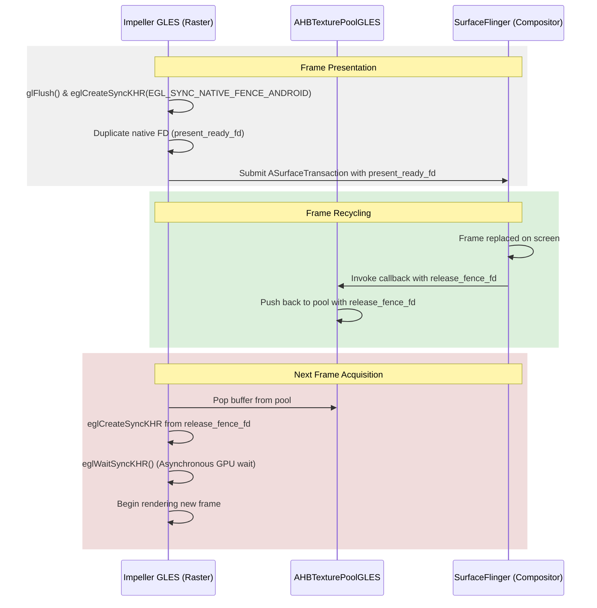
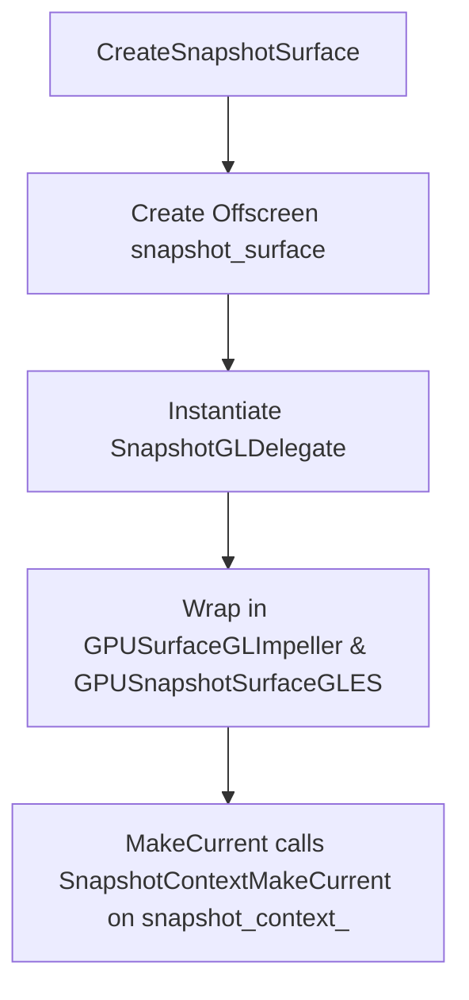

# OpenGL ES vs. Vulkan Android Hardware Buffer Swapchain Review Report

This report presents the consolidated findings, structural analyses, and concrete implementation blueprints from the 45-minute agent panel audit of the OpenGL ES Android Hardware Buffer (AHB) swapchain compared to the existing Vulkan swapchain in Impeller.

---

## 1. Executive Summary & Design Drift

The review evaluated the OpenGL ES AHB swapchain implementation on the current branch. While it successfully replicates the core logic of presenting buffers to `ASurfaceControl` under the new Hybrid Composition++ (HCPP) mode, the panel identified four critical design drifts, two driver-level crash hazards, and a performance bottleneck.

### Summary of Identified Issues & Solutions
1. **Mali & PowerVR Driver Crashes (Thread-Safety & Deletion Order)**: EGLImage cleanup on background binder threads without context causes GPU crashes. Resolved by deferring EGLImage destruction to the GLES reactor thread via a lambda capture operation, ensuring `glDeleteTextures` runs first.
2. **Platform-Thread Snapshot EGL Context Collisions (`EGL_BAD_ACCESS`)**: Platform-thread snapshotting attempts to share the current onscreen surface, colliding with the raster thread. Resolved by introducing an isolated `SnapshotGLDelegate` and a pbuffer fallback surface for platform-thread snapshotting.
3. **Unbounded Buffer Pool & Rate-Limiting Lack**: The GLES swapchain pool grows indefinitely when the compositor lags. Resolved by introducing a strict pool size limit (3–4 buffers) and a `kMaxPendingPresents = 2` CPU-side rate-limiting mechanism via EGLSync fences.
4. **MSAA Implicit Resolve Regression**: Implicit resolve on older Adreno 5xx/6xx devices drew black because the compositor did not receive resolved buffers. Resolved by dynamically blacklisting buggy Adreno renderers and falling back to explicit `glBlitFramebuffer` resolves.
5. **Color Space Mismatches (Washed-out Colors)**: EGLImages default to linear sRGB, creating color space desynchronization with Vulkan. Resolved by querying `EGL_KHR_gl_colorspace` and explicitly passing `EGL_GL_COLORSPACE_SRGB_KHR` on import.

---

## 2. Structural & Architectural Mapping

The GLES and Vulkan AHB swapchains share parallel class structures but differ fundamentally in frame pipelining and queue control:

| Component | Vulkan Backend | OpenGL ES Backend |
| :--- | :--- | :--- |
| **Swapchain Interface** | `AHBSwapchainImplVK` | `AHBSwapchainImplGLES` |
| **Texture Pooling** | `AHBTexturePoolVK` | `AHBTexturePoolGLES` |
| **Texture Source** | `AHBTextureSourceVK` | `AHBTextureSourceGLES` |
| **Transient Caching** | `SwapchainTransientsVK` | *None (recreated per frame)* |
| **MSAA Resolve** | Explicit/Implicit Pipeline | Explicit Blit (Implicit Reverted) |

### Synchronization Flow Diagram


---

## 3. Thread Safety & Lifecycle Vulnerabilities

### Issue A: EGLImage Destruction on Binder Threads
On frame completion, the binder thread executes `OnTextureUpdatedOnSurfaceControl` and drops the final reference to `AHBTextureSourceGLES`, invoking its destructor.
* **Consequence**: Destructors call `eglDestroyImageKHR` on a thread without a current EGL context, crashing Mali and PowerVR Rogue GPUs.
* **Deletion Order Compliance**: Mali/PowerVR drivers crash if EGLImage is destroyed before the associated GL texture name (`glDeleteTextures`) is freed. Since `TextureGLES` relies on a deferred reactor loop, EGLImage is normally destroyed first.
* **Consensus Blueprint**:
  Move the `UniqueEGLImageKHR` into the reactor operation lambda using `AddOperation`. Because `ReactorGLES::ReactOnce()` runs `ConsolidateHandles()` (deleting GL textures) *before* `FlushOps()` (executing lambdas), the deletion order is guaranteed:
  ```cpp
  AHBTextureSourceGLES::~AHBTextureSourceGLES() {
    if (texture_) {
      auto reactor = texture_->GetReactor();
      texture_.reset(); // Queues GL texture handle for collection (pending_collection = true)
      if (reactor) {
        // Move egl_image_ into the lambda. EGLImage destruction occurs when the lambda exits.
        reactor->AddOperation([egl_image = std::move(egl_image_)](const ReactorGLES& reactor) {
          // egl_image destroyed here on the raster thread
        });
      }
    }
  }
  ```

### Issue B: Teardown Context Cleared Order
In `AndroidSurfaceGLImpeller::TeardownOnScreenContext`, the EGL context was cleared *before* the swapchain reset, causing context-less texture destruction.
* **Fix**: Reset the swapchain first:
  ```cpp
  void AndroidSurfaceGLImpeller::TeardownOnScreenContext() {
    ahb_swapchain_.reset(); // Destroy while context is current
    GLContextClearCurrent();
    surface_control_.reset();
    onscreen_surface_.reset();
  }
  ```

---

## 4. EGL Context Collisions (`EGL_BAD_ACCESS`) & Isolation

### The Collision
Platform-thread snapshot calls (`CreateSnapshotSurface()`) attempt to make the onscreen context current, colliding with the raster thread and throwing `EGL_BAD_ACCESS`.

### Solution: Dedicated Snapshot GL Delegate & Context Redirection
Instead of fragile thread-affinity checks, we isolate snapshotting using a dedicated `SnapshotGLDelegate` and a 1x1 pbuffer surface (`CreateOffscreenSurface()`).



```cpp
class SnapshotGLDelegate final : public GPUSurfaceGLDelegate {
 public:
  SnapshotGLDelegate(
      const std::shared_ptr<AndroidContextGLImpeller>& android_context,
      std::unique_ptr<impeller::egl::Surface> snapshot_surface)
      : android_context_(android_context),
        snapshot_surface_(std::move(snapshot_surface)) {}

  ~SnapshotGLDelegate() override {
    if (snapshot_surface_) {
      android_context_->SnapshotContextMakeCurrent(snapshot_surface_.get());
      snapshot_surface_.reset();
      android_context_->SnapshotContextClearCurrent();
    }
  }

  std::unique_ptr<GLContextResult> GLContextMakeCurrent() override {
    if (!snapshot_surface_) {
      return std::make_unique<GLContextDefaultResult>(false);
    }
    bool success = android_context_->SnapshotContextMakeCurrent(snapshot_surface_.get());
    return std::make_unique<GLContextDefaultResult>(success);
  }

  bool GLContextClearCurrent() override {
    return android_context_->SnapshotContextClearCurrent();
  }

  bool GLContextPresent(const GLPresentInfo& present_info) override { return false; }
  GLFBOInfo GLContextFBO(GLFrameInfo frame_info) const override { return GLFBOInfo{.fbo_id = 0}; }
  void GLContextSetDamageRegion(const std::optional<DlIRect>& region) override {}
  sk_sp<const GrGLInterface> GetGLInterface() const override { return nullptr; }

  SurfaceFrame::FramebufferInfo GLContextFramebufferInfo() const override {
    auto info = SurfaceFrame::FramebufferInfo{};
    info.supports_readback = true;
    info.supports_partial_repaint = false;
    return info;
  }

 private:
  std::shared_ptr<AndroidContextGLImpeller> android_context_;
  std::unique_ptr<impeller::egl::Surface> snapshot_surface_;
};
```

---

## 5. Performance: Backpressure Throttling & Caching

### A. Backpressure Throttling Ring Buffer
Without throttling, `AHBTexturePoolGLES` keeps allocating buffers when the compositor lags, leading to memory bloat.
We implement a `kMaxPendingPresents = 2` ring buffer of `egl::Fence` structures, blocking the CPU in `AcquireNextDrawable` (raster thread only) using the fence from 2 frames ago:

```cpp
std::unique_ptr<Surface> AHBSwapchainImplGLES::AcquireNextDrawable() {
  if (!is_valid_) return nullptr;

  // 1. Advance the frame index
  frame_index_ = (frame_index_ + 1) % kMaxPendingPresents;

  // 2. Throttle the CPU raster thread using the fence from 2 ticks ago
  fml::UniqueFD wait_fd;
  {
    Lock lock(frame_data_mutex_);
    wait_fd = std::move(frame_data_[frame_index_]->release_fence);
  }

  if (wait_fd.is_valid()) {
    auto fence = egl::Fence::CreateFromFD(display_, std::move(wait_fd));
    if (fence) {
      TRACE_EVENT0("impeller", "AHBSwapchainImplGLES::WaitForReleaseFence");
      fence->WaitOnCPU(); // Blocks only the calling (raster) thread!
    }
  }

  // 3. Pop the next texture from the pool (now safely bounded)
  auto pool_entry = pool_->Pop();
  ...
}
```

### B. Depth-Stencil Caching
Currently, `BuildRenderTarget` creates a fresh depth-stencil renderbuffer on every frame. We propose caching `depth_stencil_transient_` in the swapchain and only recreating it on window resize.

---

## 6. Color Space, Adreno MSAA, and API 29-33 Fallbacks

1. **Wide Gamut sRGB Parity**: GLES must query `EGL_KHR_gl_colorspace` and explicitly pass `EGL_GL_COLORSPACE_SRGB_KHR` on EGLImage import to prevent washed-out rendering.
2. **Adreno MSAA Workaround**: On buggy Adreno 5xx/6xx series, disable implicit resolve (`CapabilitiesGLES::supports_implicit_msaa_ = false`) and fall back to explicit `glBlitFramebuffer` resolves.
3. **API 29-33 Fallback Composition**: Platform views fall back to legacy composition on API 29-33, but the main Flutter UI still uses the GLES AHB swapchain, meaning all EGLImage thread-safety and destruction fixes remain critical.

---

## 7. Google Test QA Strategy

Three test cases have been designed for inclusion in `impeller_unittests`:

### A. Backpressure Throttling Test
```cpp
TEST(AHBSwapchainGLESUnitTests, ThrottlingAndBufferReleaseSync) {
  auto mock_context = std::make_shared<MockContextGLES>();
  auto mock_display = mock_context->GetDisplay();
  auto swapchain = AHBSwapchainImplGLES::Create(mock_context, ...);

  int cpu_wait_count = 0;
  int gpu_wait_count = 0;
  
  mock_display->OnClientWaitSync = [&](EGLSyncKHR sync) {
    cpu_wait_count++;
    return EGL_CONDITION_SATISFIED_KHR;
  };
  mock_display->OnWaitSync = [&](EGLSyncKHR sync) {
    gpu_wait_count++;
    return EGL_TRUE;
  };

  // Frame 1 Present
  auto surface1 = swapchain->AcquireNextDrawable();
  EXPECT_EQ(cpu_wait_count, 0);
  swapchain->Present(surface1->GetTexture());

  // Frame 2 Present
  auto surface2 = swapchain->AcquireNextDrawable();
  EXPECT_EQ(cpu_wait_count, 0); // Within budget
  swapchain->Present(surface2->GetTexture());

  // Frame 3 Acquire -> Triggers Throttling wait on Frame 1's fence
  auto surface3 = swapchain->AcquireNextDrawable();
  EXPECT_EQ(cpu_wait_count, 1);
}
```

### B. Snapshot Delegate Thread-Isolation Test
```cpp
TEST(AndroidContextGLImpellerTest, SnapshotThreadIsolation) {
  auto display = egl::Display::Create();
  auto context = AndroidContextGLImpeller::Create(display);

  std::atomic<bool> raster_ready{false};
  std::atomic<bool> test_complete{false};

  // Thread 1: Raster Thread
  std::thread raster_thread([&]() {
    auto onscreen_surface = context->CreateOnscreenSurface(...);
    bool success = context->OnscreenContextMakeCurrent(onscreen_surface.get());
    EXPECT_TRUE(success);
    raster_ready = true;
    while (!test_complete) {
      std::this_thread::yield();
    }
    context->OnscreenContextClearCurrent();
  });

  // Thread 2: Platform Thread
  std::thread platform_thread([&]() {
    while (!raster_ready) {
      std::this_thread::yield();
    }
    auto snapshot_surface = context->CreateOffscreenSurface();
    auto delegate = std::make_unique<SnapshotGLDelegate>(context, std::move(snapshot_surface));
    auto result = delegate->GLContextMakeCurrent();
    EXPECT_TRUE(result->GetResult()); // Verifies no EGL_BAD_ACCESS collision
    delegate.reset();
    test_complete = true;
  });

  raster_thread.join();
  platform_thread.join();
}
```

### C. Mali/PowerVR Cleanup Verification Test
```cpp
TEST(AHBTextureSourceGLESTest, DestructorOrdering) {
  std::vector<std::string> call_sequence;

  auto mock_gl_delete = [&](GLuint texture) {
    call_sequence.push_back("glDeleteTextures");
  };
  auto mock_egl_destroy = [&](EGLImageKHR image) {
    call_sequence.push_back("eglDestroyImageKHR");
  };

  auto reactor = std::make_shared<MockReactorGLES>(mock_gl_delete);
  
  {
    auto egl_image = UniqueEGLImageKHR(EGLImageKHRWithDisplay{...}, mock_egl_destroy);
    auto texture_gles = std::make_shared<TextureGLES>(reactor);
    auto source = std::make_unique<AHBTextureSourceGLES>(std::move(texture_gles), std::move(egl_image));
    source.reset(); // drops TextureGLES ref, queues egl_image in AddOperation lambda
  }

  EXPECT_TRUE(call_sequence.empty());
  reactor->Tick(); // ConsolidateHandles() then FlushOps()

  ASSERT_EQ(call_sequence.size(), 2u);
  EXPECT_EQ(call_sequence[0], "glDeleteTextures");
  EXPECT_EQ(call_sequence[1], "eglDestroyImageKHR");
}
```
